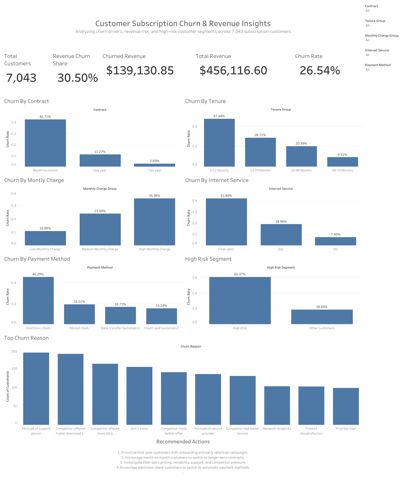

# Customer Subscription EDA & Revenue Insights

## Project Overview

This project analyzes customer subscription data for a fictional telecommunications company to identify churn patterns, recurring revenue risk, high-risk customer segments, and business opportunities for improving retention.

The goal is to simulate a realistic data analyst workflow using Python, SQL, Excel, Tableau, and business storytelling. The project moves from raw data cleaning to exploratory analysis, SQL validation, Excel validation, dashboarding, and final business recommendations.

## Business Problem

Customer churn can reduce recurring revenue, increase customer acquisition pressure, and reveal gaps in pricing, service quality, support experience, or competitive positioning.

This project investigates which customer groups are most likely to churn, how churn affects monthly revenue, and which retention strategies the company should prioritize.

## Key Business Questions

1. What is the overall customer churn rate?
2. How much monthly revenue is associated with churned customers?
3. Are churned customers higher-value than retained customers?
4. Which contract types have the highest churn rates?
5. How does customer tenure relate to churn?
6. Are higher monthly charge customers more likely to churn?
7. Which internet service types and payment methods are associated with higher churn?
8. What are the most common churn reasons?
9. Which combined customer segment represents the highest churn risk?
10. How can the company use these findings to improve retention?

## Tools Used

- Python
- Pandas
- NumPy
- Matplotlib
- Seaborn
- SQL
- DuckDB
- Excel
- Tableau
- GitHub

## Project Structure

```text
customer-subscription-eda-revenue-insights/
│
├── data/
│   ├── raw/
│   └── processed/
│
├── notebooks/
│   ├── 01_data_cleaning.ipynb
│   └── 02_exploratory_analysis.ipynb
│
├── sql/
│   ├── 00_create_tables.sql
│   ├── churn_analysis.sql
│   ├── revenue_analysis.sql
│   └── customer_segments.sql
│
├── excel/
│   └── subscription_validation_workbook.xlsx
│
├── dashboard/
│   ├── dashboard_plan.md
│   └── screenshots/
│       └── customer_churn_dashboard.png
│
├── reports/
│   ├── eda_summary_metrics.csv
│   └── final_business_insights.md
│
├── README.md
├── requirements.txt
└── .gitignore
```

## Dataset

The project uses a customer subscription churn dataset containing customer demographics, account information, service usage, billing details, churn status, churn reasons, churn score, and customer lifetime value.

The cleaned dataset is stored in:

```text
data/processed/telco_customer_churn_cleaned.csv
```

The raw dataset is kept separate from the cleaned dataset to preserve a reproducible workflow.

## Workflow

### 1. Data Cleaning

Completed in:

```text
notebooks/01_data_cleaning.ipynb
```

Cleaning steps included:

- Loaded raw customer churn data from Excel
- Inspected rows, columns, missing values, duplicates, and data types
- Standardized column names into lowercase snake_case format
- Converted `total_charges` from text/object format to numeric format
- Filled missing churn reasons for non-churned customers
- Created customer segment columns:
  - `tenure_group`
  - `monthly_charge_group`
  - `cltv_group`
- Exported the cleaned dataset to:

```text
data/processed/telco_customer_churn_cleaned.csv
```

### 2. Exploratory Data Analysis

Completed in:

```text
notebooks/02_exploratory_analysis.ipynb
```

EDA included:

- Overall churn rate
- Monthly revenue impact of churn
- Average monthly charges by churn status
- Churn rate by contract type
- Churn rate by tenure group
- Churn rate by monthly charge group
- Churn rate by internet service type
- Churn rate by payment method
- Top churn reasons
- Combined high-risk customer segment

Python visualizations were created using Matplotlib and Seaborn to communicate churn and revenue patterns.

### 3. SQL Analysis

Completed in:

```text
sql/
```

SQL analysis was completed using DuckDB. The SQL files validate the Python findings and show how the same business questions can be answered using database-style queries.

SQL files:

- `00_create_tables.sql` creates the `customers` table from the cleaned CSV
- `churn_analysis.sql` analyzes churn rates across customer groups
- `revenue_analysis.sql` analyzes revenue impact and customer value
- `customer_segments.sql` identifies high-risk and high-value customer segments

SQL concepts used:

- `SELECT`
- `COUNT`
- `SUM`
- `AVG`
- `ROUND`
- `CASE WHEN`
- `GROUP BY`
- `ORDER BY`
- Common Table Expressions, or CTEs

### 4. Excel Validation

Completed in:

```text
excel/subscription_validation_workbook.xlsx
```

The Excel workbook validates key Python and SQL outputs using formulas and pivot tables.

Validation included:

- Total customers
- Overall churn rate
- Total monthly revenue
- Churned customer monthly revenue
- Revenue churn share
- Average monthly charge by churn status
- High-risk segment churn rate
- Churn rate by contract type
- Churn rate by payment method
- Churn rate by internet service type
- Churn rate by tenure group

Excel methods used:

- PivotTables
- `SUM`
- `AVERAGE`
- `SUMIF`
- `AVERAGEIF`
- `SUMIFS`
- `COUNTIFS`
- KPI validation table
- Cross-checking Python and SQL outputs

### 5. Tableau Dashboard

A Tableau dashboard was created to summarize churn KPIs, revenue risk, customer segment patterns, churn reasons, and recommended retention actions.

The dashboard includes:

- Total customers
- Overall churn rate
- Total monthly revenue
- Churned customer monthly revenue
- Revenue churn share
- Churn by contract type
- Churn by tenure group
- Churn by monthly charge group
- Churn by internet service type
- Churn by payment method
- High-risk customer segment comparison
- Top churn reasons
- Recommended retention actions



### 6. Final Business Insights Report

Completed in:

```text
reports/final_business_insights.md
```

The final report summarizes the key churn and revenue findings, explains the business impact, and provides actionable retention recommendations.

## Key Findings

### Overall Churn

The overall customer churn rate was:

```text
26.54%
```

This means about one in four customers in the dataset churned.

### Revenue Impact

Churned customers represented:

```text
30.50% of total monthly revenue
```

This is higher than the overall customer churn rate of 26.54%, which suggests churned customers represented a larger share of revenue than their share of the customer base.

### Average Monthly Charges

Churned customers had higher average monthly charges than retained customers:

```text
Retained customers: $61.27
Churned customers: $74.44
```

This suggests churn is not only a customer-count issue but also a recurring revenue risk.

### Contract Type

Churn varied significantly by contract type:

```text
Month-to-month: 42.71%
One year: 11.27%
Two year: 2.83%
```

Month-to-month customers had much higher churn than customers on longer-term contracts.

### Customer Tenure

Newer customers had the highest churn rates:

```text
0-12 Months: 47.77%
13-24 Months: 28.71%
25-48 Months: 20.39%
49-72 Months: 9.51%
```

This suggests retention risk is highest early in the customer lifecycle.

### Monthly Charge Group

Churn increased by monthly charge level:

```text
Low Monthly Charge: 10.89%
Medium Monthly Charge: 23.94%
High Monthly Charge: 35.36%
```

Higher monthly charge customers were more likely to churn, creating additional revenue risk.

### Internet Service Type

Fiber optic customers had the highest churn rate:

```text
Fiber optic: 41.89%
DSL: 18.96%
No internet service: 7.40%
```

This suggests the company should investigate fiber optic pricing, reliability, support experience, and competitive pressure.

### Payment Method

Electronic check customers had the highest churn rate:

```text
Electronic check: 45.29%
Mailed check: 19.11%
Bank transfer automatic: 16.71%
Credit card automatic: 15.24%
```

Customers using automatic payment methods had lower churn rates than electronic check customers.

### Top Churn Reasons

The top churn reasons included:

- Attitude of support person
- Competitor offered higher download speeds
- Competitor offered more data
- Don't know
- Competitor made better offer

These reasons suggest churn may be driven by both customer support experience and competitive pressure.

### High-Risk Customer Segment

A combined high-risk segment was created using three churn-associated characteristics:

```text
Month-to-month contract
Fiber optic internet service
Electronic check payment method
```

This high-risk segment contained:

```text
1,307 customers
```

and had a churn rate of:

```text
60.37%
```

compared with:

```text
18.83%
```

for all other customers.

This suggests churn risk compounds when multiple high-risk characteristics appear together.

## Business Recommendations

Based on the analysis, the company should consider the following retention strategies:

1. Prioritize early-lifecycle retention for customers in their first 12 months.
2. Encourage month-to-month customers to switch to one-year or two-year contracts through targeted incentives.
3. Investigate fiber optic customer satisfaction, pricing, reliability, support quality, and competitor alternatives.
4. Encourage electronic check customers to switch to automatic payment methods through billing reminders or autopay discounts.
5. Monitor high monthly charge customers closely because churn in this group has a larger revenue impact.
6. Target the combined high-risk segment with proactive support, loyalty offers, billing experience improvements, and contract upgrade incentives.
7. Improve customer support training and quality assurance, since support attitude appeared as a top churn reason.
8. Track competitor offers related to download speed, data, and pricing.

## Project Outputs

Key project outputs include:

```text
data/processed/telco_customer_churn_cleaned.csv
notebooks/01_data_cleaning.ipynb
notebooks/02_exploratory_analysis.ipynb
reports/eda_summary_metrics.csv
reports/final_business_insights.md
sql/00_create_tables.sql
sql/churn_analysis.sql
sql/revenue_analysis.sql
sql/customer_segments.sql
excel/subscription_validation_workbook.xlsx
dashboard/dashboard_plan.md
dashboard/screenshots/customer_churn_dashboard.png
```

## Current Status

Completed:

1. Data cleaning
2. Exploratory data analysis
3. SQL validation and business queries
4. Excel validation workbook
5. Tableau dashboard
6. Final business insights report

## How to Reproduce

Install the required Python packages:

```bash
pip install -r requirements.txt
```

Run the notebooks in order:

```text
notebooks/01_data_cleaning.ipynb
notebooks/02_exploratory_analysis.ipynb
```

For SQL analysis, run the table setup file first:

```text
sql/00_create_tables.sql
```

Then run:

```text
sql/churn_analysis.sql
sql/revenue_analysis.sql
sql/customer_segments.sql
```

The Excel validation workbook can be found at:

```text
excel/subscription_validation_workbook.xlsx
```

The Tableau dashboard screenshot can be found at:

```text
dashboard/screenshots/customer_churn_dashboard.png
```

## Skills Demonstrated

This project demonstrates:

- Data cleaning
- Exploratory data analysis
- Churn analysis
- Revenue analysis
- Customer segmentation
- KPI development
- SQL querying
- Excel validation
- Pivot table analysis
- Tableau dashboarding
- Business storytelling
- GitHub documentation
- Data analyst project organization
